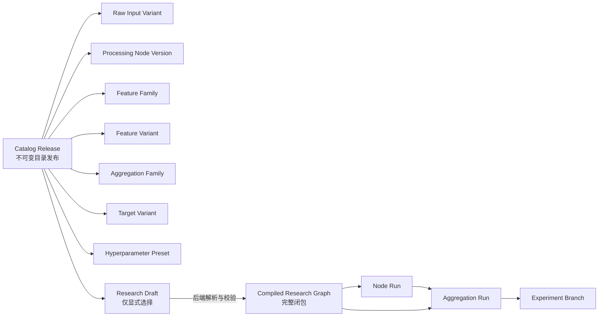

# 候鸟 v0.22：数据库与 Workspace 状态机草案

> 文档等级：`historical/non-normative`  
> `superseded_by`：[`候鸟v0.22最终开发计划.md`](候鸟v0.22最终开发计划.md) 第 2、7、12 节；Draft JSON、origin stage 和迁移顺序以 RC1 为准。

> 状态：设计讨论稿  
> 目标：把已经确认的“Raw Input + 三个加工层 + 一个聚合层”落实为可持久化、可编译、可追溯的系统结构，并兼容 v0.21 的 Workspace、Artifact、实验分支和策略编译机制。

## 1. 本轮结论摘要

v0.22 不把 Workspace 当成一张由前端完整保存的网络图，而把它拆成三个生命周期完全不同的对象：

1. **目录定义（Catalog）**：系统人工部署的节点、家族、变体、固定链路、聚合器、目标和参数预设；不可由用户在前端创建。
2. **研究草稿（Draft Intent）**：用户显式做出的选择；可修改、带 revision、允许自动保存。
3. **编译图（Compiled Graph）**：后端根据目录和草稿推导出的完整闭包；包含所有祖先、层间投影、端口绑定、聚合输入和实验分支；生成后不可变。

因此：

- 草稿只保存用户的显式意图，不保存可重新推导的祖先、锁定关系、灰置状态和自动投影。
- 前端看到的完整天赋树状态由后端实时计算并返回。
- 运行与血缘只认编译图和不可变 Artifact，不直接执行草稿 JSON。
- “可抵达聚合层”与“能被当前聚合器接受”继续保持为两个不同概念。

## 2. 总体对象关系



目录决定什么链路存在；草稿表达用户想要什么；编译器决定为了实现这些选择必须启用什么；运行系统只消费已经编译和冻结的图。

## 3. Artifact 边界

### 3.1 建议采用“组件 Artifact + 目录发布 Artifact”两级结构

仅把整个目录保存为一个大 JSON Artifact 虽然简单，但会使任何一个节点的调整都改变整个目录身份，也不利于节点级依赖、缓存复用和精确血缘。因此建议：

- 每个可执行的 `ProcessingNodeVersion` 是独立 Artifact。
- 每个可研究的 `FeatureVariant` 是独立 Artifact，并依赖其生产节点版本；Raw Input Variant 则依赖相应原始数据契约。
- 每个聚合器版本、Target Variant、Hyperparameter Preset 是独立 Artifact。
- `CatalogRelease` 是一次目录发布的清单 Artifact，依赖这次发布包含的全部组件。
- Draft 固定引用一个 `CatalogRelease`；同一草稿不会在后台悄悄切换到新版目录。

组件依赖方向按实际生产顺序保持无环：

```text
Raw Contract / Raw Variant
        ↓
Stage 1 Node Version → Stage 1 Feature Variant
        ↓
Stage 2 Node Version → Stage 2 Feature Variant
        ↓
Stage 3 Node Version → Stage 3 Feature Variant
        ↓
Aggregation Version / Target / Preset
        ↓
Catalog Release
```

其中 `CatalogRelease` 是发布清单，不是执行依赖的起点。Node Version 对上游 Variant 的依赖和固定端口绑定才构成真正的人工网络。

### 3.2 运行 Artifact 与端口级血缘

一个 Processing Node Run 可以原子地产生多个输出端口。建议：

- 整次运行对应一个 `NodeRun Artifact`。
- 每个输出端口在 `processing.node_run_output` 中保存独立的 URI、内容哈希、schema、行数和时间范围。
- `lineage.artifact_dependency` 记录 Artifact 级依赖。
- `processing.node_run_input` 再记录“上游 Artifact 的哪个 output port → 本节点的哪个 input port”。

这样既保留现有 Artifact 图，又把 v0.22 必须具备的端口级血缘补齐。Artifact dependency 的 role 应编码端口，例如 `input:close_adj`、`input:body`，避免同一上游 Artifact 被不同输入端口消费时产生歧义。

## 4. 建议的数据库边界

建议新增两个业务 schema：

- `processing`：Raw Input、三层加工、Feature Family/Variant、节点执行与端口血缘。
- `aggregation`：聚合器家族、版本、输入政策、Target Variant、参数预设与聚合运行。

保留 `workspace`、`lineage`、`strategy`、`experiment` 的原有职责。v0.21 的 `model` 表先保持只读兼容，迁移完成前不立即删除。

### 4.1 processing 目录表

#### `processing.feature_family`

表达研究语义上的家族，而不是运行打包关系。

关键字段：

- `id`
- `family_key`
- `name`
- `origin_stage`：`raw | stage_1 | stage_2 | stage_3`
- `canonical_algorithm_key`
- `input_role_signature`
- `output_semantics`
- `direction_semantics`
- `economic_hypothesis`
- `time_semantics`
- `definition_artifact_id`
- `status`

家族判断继续遵循已经确认的规则：同一公式/算法、输入角色、输出语义、方向、经济含义和时间语义，只允许声明参数不同。`body`、`range`、`shadow` 即使由同一 Node Run 生成，也必须属于不同 Family。

#### `processing.feature_variant`

表达家族内部可供用户选择的具体参数化版本。

关键字段：

- `id`
- `family_id`
- `variant_key`
- `parameters JSONB`
- `source_kind`：`raw_input | processing_output`
- `raw_contract_key`（Raw Input 时使用）
- `producer_node_version_id`（加工输出时使用）
- `producer_output_port_key`（加工输出时使用）
- `definition_artifact_id`
- `availability_status`

数据库约束保证 `raw_input` 与 `processing_output` 两种来源恰好命中一种，不能同时为空或同时存在。

#### `processing.node_version`

表达一个人工部署、可以真正执行的加工节点版本。

关键字段：

- `id`
- `node_key`
- `version`
- `stage_no`：固定为 1、2、3
- `engine_key`
- `implementation_ref`
- `parameter_schema JSONB`
- `intermediate_envelope_schema JSONB`
- `definition_artifact_id`
- `fingerprint`
- `status`

#### `processing.node_input_port` / `processing.node_output_port`

分别声明：

- 端口 key、名称、序号；
- 可接受或输出的 payload kind；
- 数值/向量/表格/文本/事件等最小 envelope；
- 频率、资产域、时间对齐和 PIT 要求；
- 是否允许 zero-copy projection；
- 对输出端口，关联其产生的 Feature Variant。

#### `processing.node_input_binding`

这是人工网络的核心边表，声明某一 Node Version 的某个输入端口允许或要求由哪个上一层 Feature Variant 提供。

关键字段：

- `node_version_id`
- `input_port_key`
- `source_feature_variant_id`
- `binding_kind`：`required | one_of | optional`
- `choice_group_key`
- `ordinal`

约束：

- Node 的实际输入必须是相邻上游层的 Feature Occurrence；source Feature 本身可以起源于更早层，但必须通过逐层 Layer Projection 到达相邻上游层。对 Stage 1，source 只能是 Raw Input。
- 禁止同层和跨层直接计算依赖。
- “原封不动穿过本层”不建成计算依赖，而在编译图中建 `LayerProjection`。
- 所有链路必须存在于目录，系统不得随机组合。

### 4.2 aggregation 目录表

#### `aggregation.family`

家族身份由算法、目标类型以及输入输出语义共同决定。Target horizon 和普通超参数不拆分 Family。

例如第一版可部署：

```text
family_key = lightgbm_future_cross_section_rank
accepted_input = 普通数值型标量信号
objective_semantics = 预测未来横截面排名/相对收益
```

#### `aggregation.version`

冻结具体实现版本、训练实现、引擎版本、输入政策版本和输出契约。

#### `aggregation.input_policy`

声明聚合器可以合法接收什么，而不是列出它最终必须使用什么。

关键约束可包括：

- 接受的 payload kind；
- 最少/最多输入数；
- 是否要求全部输入具有同一资产域、频率和日历；
- 是否允许连续值、方向值、事件值、向量值；
- 缺失值、PIT、训练历史和 warm-up 要求；
- 必须排除的语义或家族组合。

初版 LightGBM 只开放常规数值标量输入，后续特殊输入输出模型通过新的人工研究结果和新的 Family 部署，不自动放宽。

#### `aggregation.target_variant`

同一聚合 Family 下，H5、H21、H63 等未来收益窗口是不同 Target Variant，但仍属于同一 Family。

#### `aggregation.hyperparameter_preset`

同一 Family 下允许用户选择多个人工部署的参数预设；预设不同不改变 Family。

### 4.3 Catalog 发布投影表

目录的权威内容是不可变 Artifact；关系表用于查询、唯一约束和前端分页。建议所有目录投影行都带：

- `catalog_release_artifact_id`
- `component_artifact_id`
- `catalog_ordinal`

关系表必须从同一个 Artifact payload 物化并校验，不能允许业务代码分别修改 JSON 和关系行，避免两个真相源。

## 5. Draft：只保存显式意图

延续 v0.21 的 `workspace.research_draft`，增加：

- `contract_version = v0.22`
- `catalog_release_artifact_id`
- `selection_intent JSONB`
- `selection_intent_fingerprint`
- `revision`
- `last_compiled_graph_artifact_id`

建议的 `selection_intent` 只包含：

```json
{
  "asset_context": {},
  "frequency": "daily",
  "explicit_feature_variant_ids": [],
  "explicit_aggregation_inputs": [],
  "aggregation_choices": [
    {
      "family_id": "...",
      "version_id": "...",
      "target_variant_ids": ["H5", "H21"],
      "hyperparameter_preset_ids": ["balanced", "conservative"]
    }
  ],
  "strategy_choices": [],
  "defense_choices": []
}
```

不保存以下派生内容：

- 自动点亮的祖先；
- 祖先被哪些下游节点锁定；
- Layer Projection；
- 哪些项目变灰；
- 兼容性解释；
- 自动形成的节点闭包和边闭包。

原因是这些结果都依赖 Catalog、资产域、频率和当前显式选择；把它们重复写入 Draft 会产生状态漂移。客户端每次携带 `revision` 提交 intent，后端返回新的完整派生视图。

## 6. Workspace 派生状态模型

前端展示状态不应只用一个枚举。建议拆成三个互相独立的维度：

### 6.1 选择与依赖

选择状态不能使用互斥的 `selection_origin` 枚举，因为同一个 Feature Occurrence 可以既被用户直接选择，又被另一个下游依赖。改为两个正交字段：

- `is_explicit`：用户是否直接选择。
- `required_by`：需要它的下游显式选择列表。

`is_present = is_explicit OR required_by 非空`。自动祖先可以进一步被用户提升为显式选择；显式且被依赖的元素取消“主动保留”后，仍作为 required ancestor 存在。

### 6.2 可用性 `availability`

- `ready`：当前上游条件已经满足，可以直接选择。
- `requires_ancestors`：本身合法，但选择后需要自动补齐祖先。
- `hard_incompatible`：在当前 Catalog/资产域/频率/聚合器下无法合法使用。

### 6.3 锁定状态 `lock_state`

- `unlocked`
- `locked_by_descendants`

返回 `locked_by` 的下游显式选择列表和最短路径摘要，用户可以看到为什么不能直接取消。

这些维度组合后，可以准确表达此前确认的三状态计划，同时避免把“被选中”“被依赖”“可选择”和“能否取消”混为一谈。

## 7. 状态转换

### 7.1 从上游向下选择

1. 用户选择当前 `ready` 的 Family Variant。
2. 后端将它加入显式 intent。
3. 重新计算所有下游合法性。
4. 不满足输入闭包的下游项变为 `requires_ancestors` 或 `hard_incompatible`。
5. 已选项目和家族卡片置顶、着色。

上游选择不会自动替用户选择一个下游加工公式；它只改变下游可选范围。

### 7.2 直接选择最终聚合输入

1. 用户在 Stage 3/聚合候选区选择一个最终 Feature Variant。
2. 后端读取其唯一的人工生产图并计算祖先闭包。
3. 若闭包存在硬冲突，拒绝选择并返回具体冲突路径。
4. 否则将最终项记为 `explicit`，祖先记为 `required_ancestor`。
5. 对缺少显式计算的中间层建立 zero-copy `LayerProjection`。
6. 所有被依赖祖先进入 `locked_by_descendants`。

### 7.3 取消普通显式选择

若该项没有被其他显式下游依赖：

1. 从 intent 删除它。
2. 对自动祖先做可达性垃圾回收。
3. 仍被其他显式选择需要的祖先继续保留并锁定。

### 7.4 取消被锁定的上游项

禁止静默取消。采用两阶段操作：

1. `preview_cascade_remove` 返回将被删除的全部下游显式选择、实验分支影响和一次性 `impact_token`。
2. 用户确认后提交 `confirm_cascade_remove`，后端校验 draft revision 和 token 后原子执行。

若两次请求之间 Draft 已变化，token 失效，必须重新预览。

### 7.5 修改资产域、频率或 Catalog

这些上下文可能使大量选择失效，也采用影响预览，不静默清除：

- 资产域/频率：预览不兼容选择与将消失的实验分支，确认后修改。
- Catalog：Draft 默认固定旧发布；新版发布后由用户执行“Rebase Draft”，查看新增、替换、废弃和冲突，再确认迁移。

## 8. 后端求解器职责

每次 Draft intent 改变，求解器按以下顺序生成派生视图：

1. 固定 Catalog Release、资产域、频率和数据可用性上下文。
2. 验证所有显式 Feature Variant 仍存在。
3. 从最终显式选择反向展开唯一生产图。
4. 合并从上游正向选择产生的约束。
5. 生成 Node、Feature Variant、Input Binding 和 Layer Projection 闭包。
6. 计算每个候选项的 availability、selection origin、lock state 和原因。
7. 对每个聚合器执行输入政策校验。
8. 展开 Target Variant × Hyperparameter Preset × Strategy × Defense 的显式实验分支。
9. 生成稳定 fingerprint；只有用户执行 compile 时才创建不可变 Artifact。

求解器不得：

- 随机生成未在 Catalog 中声明的链路；
- 在多个可能生产图之间自行猜测；
- 因模型“理论上能容纳一切”而绕过输入政策；
- 把所有可抵达聚合层的信号自动送入聚合器。

## 9. Compiled Graph

建议新增 `workspace.compiled_research_graph`，并在迁移期与 v0.21 的 `compiled_research_spec` 并存。

主表保存：

- `artifact_id`
- `contract_version`
- `catalog_release_artifact_id`
- `source_draft_id` 与 `source_revision`
- `asset_context`
- `frequency`
- `normalized_graph JSONB`
- `graph_fingerprint`
- 节点、边、投影、最终输入和实验分支计数

同时物化不可变关系投影：

- `workspace.compiled_graph_node`
- `workspace.compiled_graph_edge`
- `workspace.compiled_layer_projection`
- `workspace.compiled_aggregation_instance`
- `workspace.compiled_aggregation_input`
- `workspace.compiled_experiment_branch`

`normalized_graph` 是语义权威内容；关系子表仅用于查询、FK 约束、运维和页面加载。它们必须在同一事务中从 payload 生成，不允许后续单独修改。

### 9.1 聚合实例展开

同一模型 Family 下：

```text
选中输入集合
× Target Variant（H5 / H21 / H63）
× Hyperparameter Preset
× Strategy
× Defense Option
= 多个明确的 Experiment Branch
```

每个实验仍只有：

- 一个聚合模型实例；
- 一个 Target Variant；
- 一个 Hyperparameter Preset；
- 一个策略；
- 零个或一个防御策略。

Experiment/Product 页面展示最终实例的 Family、版本、target、超参数、直接聚合输入、策略和防御设置；更上游加工图通过血缘入口查看。

## 10. 运行期数据契约

### 10.1 严格边界

- Raw Input：原始技术面、基本面、新闻等输入必须有明确的数据契约、时间语义和 PIT 语义。
- Aggregation Input：必须已经转化为聚合器声明可接受的数字或向量信号。
- Aggregation Output：有方向、排名意义及明确资产/时间索引的数值或向量信号。

### 10.2 中间层最小 envelope

中间层不强迫统一为表格，但每个 payload 至少声明：

- `payload_kind`
- `schema_ref` / `schema_hash`
- `storage_uri`
- `content_hash`
- `asset_scope`
- `time_range`
- `frequency_or_event_time_semantics`
- `pit_policy`
- `producer_artifact_id`
- `output_port_key`

具体数据可以是表格、张量/向量、文本、事件集合、pattern 结构或未来新增类型。下游合法性由端口契约判断，而不是由统一 DataFrame 假设判断。

## 11. 前端接口建议

避免一次加载所有 Family × Variant × 状态。建议接口按层、家族和搜索条件分页：

- `GET /workspace/{draft}/view`：返回显式 intent 摘要、各层选中/锁定项目和计数。
- `GET /workspace/{draft}/stage/{n}/families`：分页返回 Family 卡片、变体数、选择数和状态聚合。
- `GET /workspace/{draft}/family/{id}/variants`：展开具体变体。
- `POST /workspace/{draft}/selection`：基于 revision 提交显式选择事件。
- `POST /workspace/{draft}/cascade-removal/preview`
- `POST /workspace/{draft}/cascade-removal/confirm`
- `POST /workspace/{draft}/context-change/preview`
- `POST /workspace/{draft}/rebase/preview`
- `POST /workspace/{draft}/compile`

所有写接口返回：

- 新 revision；
- 本次状态变化 diff；
- 新增/解除的锁；
- 兼容性变化；
- 实验分支数量变化；
- 必要时返回可解释的冲突路径。

前端无需自行实现图求解逻辑，只负责渲染后端结果和保存当前 revision。

## 12. 与 v0.21 的迁移关系

迁移建议采用旁路新增，不直接改写现有运行记录：

1. 保留现有 `research_draft`、`compiled_research_spec`、`compiled_model_instance` 和历史 Artifact。
2. 新增 v0.22 Catalog、Compiled Graph 和聚合实例表。
3. 将 51 个 v0.21 信号逐一映射为 Feature Family、Variant、三层生产图和必要 Layer Projection。
4. 每个 v0.21 preset/model identity 映射到新的 Aggregation Family、Target Variant、Hyperparameter Preset。
5. 先做历史行为 parity；新能力在 parity 通过后开启。
6. Product/Experiment 查询层同时识别 v0.21 spec 与 v0.22 graph，避免历史结果失读。

## 13. 当前建议冻结的设计决定

以下决定建议直接冻结：

1. Draft 只存显式意图，派生树由后端计算。
2. 编译后固化完整节点、边、端口、投影和聚合分支。
3. Draft 固定 Catalog Release，不自动升级。
4. 被锁定祖先、资产域/频率变更、Catalog Rebase 都采用影响预览后确认。
5. Artifact 图保留粗粒度依赖，业务关系表补充端口级依赖。
6. 多输出节点按一次 Node Run 原子执行，但输出端口和 Feature Family 身份独立。
7. 目录 JSON Artifact 是权威定义，关系表是同事务产生的不可变查询投影。

## 14. 下一步需要确认的四个问题

### Q1：Catalog Artifact 粒度

建议采用“每个可执行组件独立 Artifact + Catalog Release 汇总 Artifact”。优点是精确血缘、缓存复用和局部版本演进；代价是 Artifact 数量明显增加。

### Q2：Draft 的 Catalog 升级方式

建议 Draft 永久固定创建时使用的 Catalog Release；只有用户主动 Rebase 才升级，并先预览影响。这样旧草稿不会因后台发布新节点而改变结果。

### Q3：schema 划分

建议加工层使用 `processing`，聚合层使用独立 `aggregation`；旧 `model` 仅承担 v0.21 兼容。这样可以明确“加工层也可能使用模型，但模型不等于聚合层”。

### Q4：所有破坏性选择变化是否统一二阶段确认

建议统一：锁定祖先取消、资产域/频率修改、Catalog Rebase 都先返回 impact preview，再由用户确认。普通叶子选择/取消仍然即时完成。
