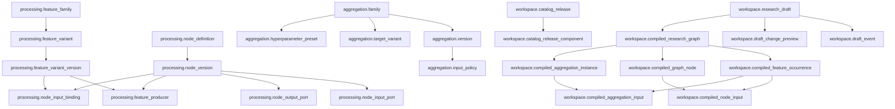

# 候鸟 v0.22：物理 Schema、编译契约与 Workspace API 协议

> 文档等级：`historical/non-normative`  
> `superseded_by`：[`候鸟v0.22最终开发计划.md`](候鸟v0.22最终开发计划.md) 第 3—7、11、12 节；旧 `processing.payload_contract_version`、`one_of/optional`、无条件聚合轴和 Graph-owned Run 均已废弃。

> 状态：设计讨论稿  
> 前置决定：`候鸟v0.22数据库与Workspace状态机草案.md` 中 Q1—Q4 已全部确认。  
> 本文目标：把逻辑设计落实到可以指导 Alembic migration、后端契约和前端交互实现的粒度。

## 1. 本轮新增的关键区分

### 1.1 用户选择 Feature Occurrence，不直接选择 Node

用户在 Workspace 中操作的基本对象应定义为：

```text
Feature Selection Ref = Logical Feature Variant + Visible Stage
```

例如同一个 `close_to_ma_20`：

- 在 Stage 1 被选择，表示它作为 Stage 1 的显式输出参与后续合法性筛选；
- 在 Stage 2 出现，可能只是从 Stage 1 自动投影而来；
- 在 Stage 3 被显式选择，表示它进入最终聚合输入集合。

因此同一个 Feature Variant 可以在不同层有不同状态。用户不直接选择 `ProcessingNodeVersion`；节点是否进入编译图，由后端根据 Feature 的唯一生产图推导。

### 1.2 Draft 保存逻辑身份，Compiled Graph 保存精确版本

Draft Intent 保存稳定的逻辑 ID：

- Feature Family / Variant；
- Aggregation Family；
- Target Variant；
- Hyperparameter Preset；
- Strategy / Defense Preset。

Draft 同时固定一个 Catalog Release，所以这些逻辑 ID 可以解析到唯一组件版本。

Compiled Graph 必须保存精确的版本 ID 和 Artifact ID。这样：

- Draft Rebase 可以把仍存在的逻辑 Variant 映射到新实现版本；
- 已编译实验不会因组件升级而改变；
- 同一语义 Variant 的执行实现升级不必伪装成新的研究参数 Variant。

### 1.3 Family、Variant、Version 三层身份

```text
Feature Family
    └── Feature Variant（参数化研究身份）
            └── Feature Variant Version（某次 Catalog 中的精确可执行版本）
```

例如：

```text
Family: total_return
├── Variant: total_return(window=5)
│   ├── Version: implementation v1
│   └── Version: implementation v2
└── Variant: total_return(window=21)
    └── Version: implementation v1
```

`window=5` 与 `window=21` 是同一 Family 下不同 Variant；实现修复但语义不变时，是同一 Variant 下的新 Version。

## 2. 物理 Schema 总览



## 3. Catalog 物理表

以下字段类型采用 PostgreSQL 语义：ID 使用 UUID，结构化定义使用 JSONB，fingerprint 使用 64 字符小写 SHA-256。

### 3.1 `processing.feature_family`

稳定的研究家族身份。

| 字段 | 约束/说明 |
|---|---|
| `feature_family_id` | PK |
| `family_key` | 全局唯一、不可复用 |
| `name` | 展示名 |
| `canonical_algorithm_key` | 公式/算法身份 |
| `input_role_signature` | 规范化 JSONB |
| `output_semantics` | 规范化 JSONB |
| `direction_semantics` | higher/lower/event/neutral 等 |
| `economic_hypothesis` | 研究解释 |
| `time_semantics` | 规范化 JSONB |
| `definition_fingerprint` | UNIQUE |
| `created_at` | 不可变创建时间 |

Family 不保存 `origin_stage`。原因是 Stage 属于具体生产部署；Family 是研究语义身份，不应因未来允许同一公式部署到不同加工层而被错误拆分。

### 3.2 `processing.feature_variant`

稳定的参数化研究身份。

| 字段 | 约束/说明 |
|---|---|
| `feature_variant_id` | PK |
| `feature_family_id` | FK |
| `variant_key` | UNIQUE |
| `parameters` | 规范化 JSONB |
| `parameter_fingerprint` | Family 内 UNIQUE |
| `display_order` | 非负整数 |
| `created_at` | 创建时间 |

同一个 Family 内，相同规范化参数不得重复建 Variant。

### 3.3 `processing.feature_variant_version`

Catalog 可引用的不可变 Feature 版本。

| 字段 | 约束/说明 |
|---|---|
| `feature_variant_version_id` | PK |
| `feature_variant_id` | FK |
| `version_number` | 同一 Variant 内递增，`>=1` |
| `artifact_id` | FK lineage.artifact，UNIQUE |
| `payload_contract_version_id` | FK |
| `origin_stage` | `0..3`；0 表示 Raw Input |
| `version_fingerprint` | UNIQUE |
| `status` | active/deprecated/withdrawn |

UNIQUE：`(feature_variant_id, version_number)`。

`deprecated` 仍可供固定旧 Catalog 的 Draft/Compiled Graph 使用；`withdrawn` 仅用于严重数据或实现问题，并必须通过 Artifact invalidation 表达，不能删除历史行。

### 3.4 `processing.payload_contract_version`

中间数据结构的最小 envelope 契约。

主要字段：

- `payload_contract_version_id`
- `contract_key`、`version_number`
- `artifact_id`
- `payload_kind`：`scalar_series | vector_series | table | event_set | text_collection | tensor | structured_pattern | other`
- `schema_document JSONB`
- `schema_fingerprint`
- `asset_index_semantics JSONB`
- `time_index_semantics JSONB`
- `pit_policy JSONB`
- `storage_requirements JSONB`

具体中间数据不需要统一成表格，只需满足端口引用的契约版本。

### 3.5 `processing.node_definition`

稳定的逻辑节点身份。

| 字段 | 说明 |
|---|---|
| `node_definition_id` | PK |
| `node_key` | UNIQUE |
| `name` | 展示名 |
| `node_kind` | transform/model/rule/nlp/pattern/other |
| `description` | 说明 |

### 3.6 `processing.node_version`

不可变的可执行节点版本。

| 字段 | 约束/说明 |
|---|---|
| `node_version_id` | PK |
| `node_definition_id` | FK |
| `version_number` | 同一节点递增 |
| `artifact_id` | UNIQUE Artifact FK |
| `stage_no` | CHECK `1..3` |
| `engine_key` | 执行引擎 |
| `implementation_ref` | 镜像/函数/模型 Artifact 引用信息 |
| `runtime_parameters` | 冻结的 JSONB |
| `version_fingerprint` | UNIQUE |
| `status` | active/deprecated/withdrawn |

UNIQUE：`(node_definition_id, version_number)`。

### 3.7 `processing.node_input_port` / `node_output_port`

复合主键建议使用：

```text
(node_version_id, port_key)
```

两表共同保存：

- `ordinal`，同一节点内 UNIQUE；
- `payload_contract_version_id`；
- `frequency_policy`；
- `asset_scope_policy`；
- `alignment_policy JSONB`；
- `minimum_count / maximum_count`（输入端口或 choice group 需要时）。

输出端口不直接保存 Family 身份，以避免 Node Version 与 Feature Variant Version 之间形成双向身份依赖；生产关系由下一张表单独表达。

### 3.8 `processing.feature_producer`

每个 Feature Variant Version 必须有且只有一个生产来源。

| 字段 | 说明 |
|---|---|
| `feature_variant_version_id` | PK/FK |
| `source_kind` | raw_input/node_output |
| `raw_contract_artifact_id` | Raw 时非空 |
| `node_version_id` | Node output 时非空 |
| `output_port_key` | Node output 时非空 |

CHECK：

- `raw_input`：只有 `raw_contract_artifact_id` 非空；
- `node_output`：只有 `node_version_id + output_port_key` 非空。

UNIQUE：`(node_version_id, output_port_key)`，保证一个节点输出端口只定义一个研究 Feature 输出。一个 Node Version 可以有多个输出端口，因此可以原子产生 body、range、shadow 等不同 Family。

### 3.9 `processing.node_input_binding`

人工网络的固定合法链路。

| 字段 | 说明 |
|---|---|
| `node_version_id` | FK |
| `input_port_key` | FK 至该节点 input port |
| `source_feature_variant_version_id` | 可接受的上游 Feature |
| `binding_kind` | required/one_of/optional |
| `choice_group_key` | one_of 时使用 |
| `ordinal` | 稳定顺序 |

重要语义：Node 永远消费“前一层的 Feature Occurrence”，但该 Feature 的原始生产层可以更早。例如 Stage 3 Node 可以消费一个起源于 Stage 1、经 Stage 2 投影后出现的 Feature。

发布校验必须保证：

```text
source origin_stage < node stage_no
```

编译器负责补齐到 `node.stage_no - 1` 的逐层 Layer Projection。Stage 1 Node 因此只能消费 origin_stage=0 的 Raw Input。

### 3.10 Aggregation 目录表

#### `aggregation.family`

- `aggregation_family_id`
- `family_key` UNIQUE
- `algorithm_key`
- `objective_semantics`
- `input_semantics`
- `output_semantics`
- `definition_fingerprint`

#### `aggregation.version`

- `aggregation_version_id`
- `aggregation_family_id`
- `version_number`
- `artifact_id` UNIQUE
- `engine_key`
- `implementation_ref`
- `output_contract_version_id`
- `version_fingerprint` UNIQUE
- `status`

#### `aggregation.input_policy`

一个 Aggregation Version 可以有多个命名输入 slot。

- `aggregation_version_id`
- `slot_key`
- `ordinal`
- `accepted_payload_kinds`
- `accepted_contract_rules JSONB`
- `minimum_count / maximum_count`
- `missing_value_policy`
- `frequency_policy`
- `asset_scope_policy`

初版 LightGBM 的普通数值输入可以配置为一个 `numeric_features` slot，允许 N 个普通数字型标量 Feature，但仍执行完整 PIT、频率、资产域和最少历史要求。

#### `aggregation.target_variant`

- `target_variant_id`：稳定逻辑 ID
- `aggregation_family_id`
- `target_key`
- `horizon_sessions`
- `target_semantics`
- `artifact_id`
- `target_fingerprint`

H5/H21/H63 是同 Family 下不同 Target Variant。

#### `aggregation.hyperparameter_preset`

- `hyperparameter_preset_id`：稳定逻辑 ID
- `aggregation_family_id`
- `preset_key`
- `version_number`
- `parameters JSONB`
- `artifact_id`
- `parameter_fingerprint`

同类超参数预设不拆 Family；参数内容调整需要新 version_number，旧实验继续引用旧 Artifact。

## 4. Catalog Release

### 4.1 `workspace.catalog_release`

- `catalog_release_id`
- `artifact_id` UNIQUE
- `catalog_key`
- `version_number`
- `semantic_version`
- `contract_version`
- `document JSONB`
- `catalog_fingerprint` UNIQUE
- `published_at`

### 4.2 `workspace.catalog_release_component`

- `catalog_release_id`
- `component_kind`
- `component_artifact_id`
- `stage_no` nullable
- `ordinal`

PK：`(catalog_release_id, component_kind, component_artifact_id)`。

它是发布清单，不替代各业务表的 FK。发布服务必须验证：

1. 所有 Node 输入链路引用的组件均包含在同一 Release；
2. 每个逻辑 Variant 在同一 Release 中最多出现一个 Version；
3. 所有 Artifact dependencies 无环；
4. Stage、端口、payload contract 和 aggregation policy 完整；
5. 没有 Node 依赖同层或未来层 Feature；
6. 每个 Feature Version 恰好有一个 Producer；
7. Family/Variant/Version 身份规则没有被破坏。

## 5. Draft 物理表与事件审计

### 5.1 扩展现有 `workspace.research_draft`

为了保持 v0.21 草稿可读，建议不另建 Draft 主表，而是新增：

- `contract_version`，历史行回填 `v0.21`；
- `catalog_release_id`，v0.21 可空、v0.22 必填；
- `selection_fingerprint`；
- `last_compiled_graph_artifact_id`；
- 原 `selection JSONB` 在 v0.22 语义下保存 Draft Intent。

不要复用 `last_compiled_artifact_id`：当前字段实际可能指向 Suite Artifact，改变语义会破坏历史解释。

建议通过 CHECK 保证：

```text
contract_version = 'v0.21' OR catalog_release_id IS NOT NULL
```

### 5.2 v0.22 Draft Intent

```json
{
  "asset_context": {
    "security_ids": [],
    "data_input_bindings": {}
  },
  "frequency": "weekly",
  "explicit_feature_occurrences": [
    {
      "feature_variant_id": "logical-uuid",
      "stage_no": 1
    },
    {
      "feature_variant_id": "logical-uuid",
      "stage_no": 3
    }
  ],
  "aggregation_selections": [
    {
      "aggregation_family_id": "logical-uuid",
      "target_variant_ids": ["logical-uuid"],
      "hyperparameter_preset_ids": ["logical-uuid"]
    }
  ],
  "strategy_selections": [
    {
      "strategy_preset_id": "logical-uuid",
      "defense_preset_ids": ["none-or-logical-uuid"]
    }
  ]
}
```

规则：

- `(feature_variant_id, stage_no)` 不得重复；
- 只有 `stage_no=3` 的显式 Feature Occurrence 进入所有已选聚合器；
- Stage 0—2 的选择只影响加工树和下游合法性；
- 聚合器必须全部接受完整 Stage 3 输入集合，不能为不同聚合器静默丢弃不同输入；
- 自动祖先、投影和锁不写入 intent。

### 5.3 `workspace.draft_event`

这是审计日志，不是 event-sourcing 的权威状态。

- `draft_event_id`
- `research_draft_id`
- `idempotency_key`
- `event_type`
- `event_payload JSONB`
- `revision_before`
- `revision_after`
- `selection_fingerprint_after`
- `applied`：无状态变化时为 false
- `researcher_id`
- `created_at`

UNIQUE：`(research_draft_id, idempotency_key)`。

事件 payload 不存完整 Draft，只存命令及必要原因。权威当前状态仍是 `research_draft.selection`。

### 5.4 `workspace.draft_change_preview`

为破坏性二阶段确认提供跨进程、可过期的服务端状态。

- `preview_id` / 随机 `impact_token`
- `research_draft_id`
- `expected_revision`
- `change_type`
- `requested_change JSONB`
- `impact_document JSONB`
- `impact_fingerprint`
- `expires_at`
- `consumed_at` nullable
- `created_at`

确认时对 Draft 和 Preview 同时 `FOR UPDATE`，校验 revision、未过期、未消费，然后原子修改 Draft 并标记 Preview 已消费。建议有效期 15 分钟。

## 6. Derived Workspace View 契约

Derived View 不持久化为数据库真相源，可以按 `(draft revision, catalog release, data availability revision)` 缓存。

### 6.1 Feature Occurrence 状态

```json
{
  "feature_variant_id": "...",
  "feature_variant_version_id": "...",
  "family_id": "...",
  "stage_no": 3,
  "is_explicit": true,
  "required_by": [],
  "availability": "ready",
  "lock_state": "unlocked",
  "locked_by": [],
  "producer": {
    "kind": "node_output",
    "node_version_id": "...",
    "output_port_key": "pattern_count"
  },
  "select_effect": {
    "ancestor_count": 4,
    "projection_count": 1
  },
  "reason_codes": []
}
```

### 6.2 View 元信息

- `draft_id`
- `revision`
- `catalog_release_id`
- `selection_fingerprint`
- `derived_state_fingerprint`
- `data_availability_revision`
- 各层 explicit/required/available/incompatible 数量；
- 当前 Stage 3 聚合输入摘要；
- 聚合实例和实验分支预计数量；
- blockers/warnings。

候选 Family/Variant 使用分页接口返回，不把整个 Catalog 的完整状态塞入 Draft GET 响应。

## 7. 编译器输入契约

```text
compile(
    draft_intent,
    pinned_catalog_release,
    asset_context_snapshot,
    data_availability_snapshot,
    compiler_contract_version
) -> CompilationResult
```

所有输入必须可版本化或可 fingerprint。编译器不得读取未包含在输入身份中的“当前最新目录”或隐式默认值。

### 7.1 编译阶段

#### Phase A：解析逻辑身份

- 将 Draft 的逻辑 ID 解析为固定 Catalog 中的唯一 Version；
- 检查 deprecated/withdrawn/invalidation；
- 检查资产域、频率、原始数据和 PIT 可用性。

#### Phase B：展开 Feature Occurrence

- 为每个显式 `(variant, stage)` 创建目标 occurrence；
- 若 `origin_stage < visible_stage`，逐层建立 projection occurrence；
- 若 Feature 由 Node 产生，读取唯一 Producer，并展开 Node 的固定输入绑定；
- 所有 Node 输入必须来自 `node.stage_no - 1` 的 occurrence；
- 递归展开直至 Raw Input，合并共享祖先。

#### Phase C：验证人工图

- 检测循环；
- 禁止同层计算依赖；
- 禁止跳层计算边；
- 验证端口 payload contract、时间对齐、资产域和频率；
- 验证 required/one_of/optional 输入组；
- 验证每个具体输出只有唯一生产图。

#### Phase D：聚合输入校验与实例展开

- Stage 3 explicit occurrences 构成唯一聚合输入集合；
- 每个已选 Aggregation Family 都必须接受完整集合；
- 明确分配每个 Feature 到唯一 input slot；歧义分配必须报错，不能猜测；
- 展开 Aggregation Version × Target Variant × Hyperparameter Preset。

#### Phase E：策略与防御分支

- 每个实验 Branch 只有一个聚合实例、一个策略、零或一个防御策略；
- 多个 Target、参数、策略或 Defense 形成独立分支；
- 分支数量完全由编译结果返回，前端不得自行估算。

#### Phase F：规范化与 fingerprint

所有集合按稳定逻辑键排序；端口和输入使用显式 ordinal。fingerprint 至少覆盖：

- 精确组件 Artifact IDs；
- Feature occurrence、Node、input edge、projection；
- 资产上下文和数据可用性 snapshot；
- Aggregation input order、target、hyperparameters；
- Strategy、Defense；
- compiler contract version。

## 8. Compiled Graph 物理表

### 8.1 `workspace.compiled_research_graph`

- `compiled_research_graph_id`
- `artifact_id` UNIQUE
- `graph_fingerprint` UNIQUE
- `contract_version`
- `compiler_version_artifact_id`
- `catalog_release_id`
- `source_research_draft_id`
- `source_draft_revision`
- `asset_context_snapshot_artifact_id`
- `data_availability_snapshot_artifact_id`
- `frequency`
- `normalized_graph JSONB`
- `node_count / occurrence_count / edge_count / projection_count`
- `aggregation_instance_count / strategy_branch_count`
- `created_at`

`source_draft_id + revision` 用于审计，不作为唯一约束；同一 Draft revision 在相同输入下重复编译应由 `graph_fingerprint` 复用已有结果。

### 8.2 `workspace.compiled_feature_occurrence`

- `compiled_feature_occurrence_id`
- `compiled_research_graph_id`
- `feature_variant_version_id`
- `stage_no`：0..3
- `is_explicit`：用户是否直接选择
- `is_required`：是否存在下游依赖；完整依赖列表保存在 normalized graph 或单独关系投影中
- `production_kind`：raw_input/node_output/layer_projection
- `source_occurrence_id`：projection 时引用前一层 occurrence
- `compiled_graph_node_id + output_port_key`：node_output 时使用
- `occurrence_fingerprint`

UNIQUE：`(compiled_research_graph_id, feature_variant_version_id, stage_no)`。

XOR 约束：

- raw：无 source/node；
- projection：只有 source_occurrence；
- node_output：只有 node/output port。

projection 必须满足 `source.stage_no + 1 = target.stage_no`，由编译写入服务和集成测试保证；如果后续出现绕过服务写库的风险，再增加 deferred constraint trigger。

### 8.3 `workspace.compiled_graph_node`

- `compiled_graph_node_id`
- `compiled_research_graph_id`
- `node_version_id`
- `stage_no`
- `node_fingerprint`

同一图中相同 Node Version 是否允许执行多次，取决于其参数和输入绑定是否相同。建议唯一身份使用 node execution fingerprint，而不是简单 UNIQUE node_version_id。

### 8.4 `workspace.compiled_node_input`

- `compiled_graph_node_id`
- `input_port_key`
- `source_occurrence_id`
- `choice_group_key`
- `ordinal`

PK：`(compiled_graph_node_id, input_port_key, ordinal)`。

这张表提供真正的端口级语义血缘；运行后再映射到具体 payload Artifact。

### 8.5 `workspace.compiled_aggregation_instance`

- `compiled_aggregation_instance_id`
- `compiled_research_graph_id`
- `aggregation_version_id`
- `target_variant_id`
- `hyperparameter_preset_id`
- `instance_key`
- `instance_fingerprint` UNIQUE
- `output_contract_version_id`

### 8.6 `workspace.compiled_aggregation_input`

- `compiled_aggregation_instance_id`
- `slot_key`
- `ordinal`
- `compiled_feature_occurrence_id`

CHECK/FK 语义要求输入 occurrence 必须属于 Stage 3 且为 explicit。所有聚合实例的 Feature 输入集合必须相同，只允许 slot 分配和排序按 Aggregation policy 明确变化。

### 8.7 Strategy/Experiment 桥接

为了不修改 v0.21 历史行语义，建议新增：

- `strategy.compiled_strategy_branch`
- `experiment.research_suite_graph_binding`
- `experiment.research_cell_graph_binding`

而不是把现有 `compiled_strategy_version`、`compiled_model_instance` 的非空 FK 改成一组复杂的 v0.21/v0.22 XOR nullable 字段。

查询层提供统一 view：

- `workspace.compiled_aggregation_identity_all`
- `strategy.compiled_strategy_identity_all`
- `experiment.research_branch_identity_all`

Product/Experiment 页面通过统一 view 展示历史 v0.21 model 和新 v0.22 aggregation identity。

## 9. 运行期血缘表

### 9.1 `processing.node_run`

- `node_run_id`
- `artifact_id`
- `compiled_graph_node_id`
- `execution_fingerprint`
- `status`
- `started_at / completed_at`

### 9.2 `processing.node_run_input`

- `node_run_id`
- `input_port_key`
- `upstream_artifact_id`
- `upstream_output_port_key`
- `content_hash`
- `ordinal`

### 9.3 `processing.node_run_output`

- `node_run_id`
- `output_port_key`
- `storage_uri`
- `content_hash`
- `schema_fingerprint`
- `row_or_item_count`
- `time_range`
- `payload_metadata JSONB`

Node Run Artifact 依赖所有上游 payload Artifact；dependency role 使用 `input:{port_key}:{ordinal}`。关系表进一步保存具体上游输出端口。

Aggregation Run 采用相同结构，放在 `aggregation.run / run_input / run_output`。

## 10. Workspace API 协议

继续使用现有 `/api/v2` 根路径，避免把产品 v0.22 与 HTTP 大版本混淆；新资源放到 graph-aware 路径。

### 10.1 创建 Draft

```http
POST /api/v2/workspace/graph-drafts
```

请求包括 `idempotency_key`、researcher、name、Catalog Release、初始资产域和频率。返回 revision=1 和 Derived View 摘要。

### 10.2 获取 Draft View

```http
GET /api/v2/workspace/graph-drafts/{draft_id}
```

返回：Draft Intent、revision、Catalog、状态计数、Stage 3 输入、分支计数、blockers。完整候选项另行分页。

### 10.3 获取某层 Family

```http
GET /api/v2/workspace/graph-drafts/{draft_id}/stages/{stage_no}/families
    ?search=
    &selection_filter=selected|locked|all
    &availability_filter=ready|requires_ancestors|hard_incompatible
    &cursor=
```

已选和锁定 Family 始终返回 pinned 标识，前端置顶并采用不同颜色。Family 展开后请求 Variant occurrence。

### 10.4 语义事件接口

```http
POST /api/v2/workspace/graph-drafts/{draft_id}/events
```

统一请求 envelope：

```json
{
  "idempotency_key": "uuid",
  "expected_revision": 12,
  "event": {
    "type": "select_feature_occurrence",
    "feature_variant_id": "uuid",
    "stage_no": 3
  }
}
```

初版事件类型：

- `select_feature_occurrence`
- `deselect_feature_occurrence`
- `select_aggregation_family`
- `deselect_aggregation_family`
- `set_target_variants`
- `set_hyperparameter_presets`
- `select_strategy`
- `deselect_strategy`
- `set_defense_presets`
- `rename_draft`

一次事件在单一数据库事务中：

1. `FOR UPDATE` Draft；
2. 校验 expected revision 和 idempotency；
3. 应用到 intent 的临时副本；
4. 运行求解器验证；
5. 若合法，保存 intent/fingerprint、revision+1、追加 audit event；
6. 返回 state diff 和新的 view 摘要。

若事件是语义 no-op，返回 `applied=false`，revision 不增加。

### 10.5 破坏性变更预览与确认

```http
POST /api/v2/workspace/graph-drafts/{draft_id}/change-previews
POST /api/v2/workspace/graph-drafts/{draft_id}/change-previews/{impact_token}/confirm
```

change type：

- `cascade_deselect`
- `change_asset_context`
- `change_frequency`
- `rebase_catalog`

Preview 返回：

- 将删除的显式选择；
- 将解除/新增的祖先；
- 不再合法的聚合器、策略和 Defense；
- 聚合实例和实验分支数量变化；
- 新增/消失的数据要求；
- expiry 和 impact token。

Confirm 请求仍带 `idempotency_key + expected_revision`。

### 10.6 Compile

```http
POST /api/v2/workspace/graph-drafts/{draft_id}/compile
```

请求：`idempotency_key + expected_revision`。

后端必须重新求解，不信任客户端缓存的 Derived View。成功后原子创建或复用：

- Compiled Graph Artifact；
- normalized graph 和关系投影；
- Aggregation Instances；
- Strategy Branches；
- Draft 的 `last_compiled_graph_artifact_id`。

Compile 不增加 Draft revision，因为它不改变用户 intent。

### 10.7 启动实验

建议将编译和实验启动作为两个后端命令：

```http
POST /api/v2/workspace/graph-drafts/{draft_id}/compile
POST /api/v2/workspace/graph-suites
```

`graph-suites` 接收 `compiled_research_graph_id`，不再接收可变 Draft。前端仍可以提供一个“开始实验”按钮，内部顺序执行 compile → submit。这样重试 Suite、基于同一图创建 exploratory/formal Suite，以及审计具体运行身份都更清晰。

## 11. 错误协议

统一响应至少包含 `code`、`message`、`details`、`correlation_id`。

| HTTP | code | 含义 |
|---|---|---|
| 409 | `draft_revision_conflict` | expected revision 落后；返回 current_revision |
| 409 | `selection_conflict` | 当前图中选择不合法；返回冲突路径 |
| 409 | `cascade_confirmation_required` | 尝试直接删除被锁祖先 |
| 409 | `idempotency_payload_conflict` | 相同 key 被不同请求复用 |
| 410 | `impact_preview_expired` | preview 已过期或已消费 |
| 422 | `event_contract_invalid` | 请求形状或 stage 范围错误 |
| 422 | `catalog_component_unknown` | 固定 Catalog 中不存在该逻辑 ID |
| 422 | `aggregation_input_rejected` | 某聚合器拒绝完整 Stage 3 输入集合 |
| 422 | `production_graph_invalid` | 人工目录图自身有缺陷，应阻止发布时出现 |
| 503 | `data_availability_unresolved` | 无法取得用于合法性判断的数据快照 |

冲突路径示例：

```json
{
  "code": "selection_conflict",
  "details": {
    "reason_code": "payload_contract_incompatible",
    "path": [
      {"kind": "feature", "key": "news_embedding"},
      {"kind": "aggregation", "key": "lightgbm_numeric_v1"}
    ]
  }
}
```

## 12. 事务与并发原则

1. 所有 Draft 写命令必须同时带 idempotency key 和 expected revision。
2. Draft 行在事件应用、Preview confirm 和 Compile 标记期间使用 `FOR UPDATE`。
3. Catalog 和 Compiled Graph 只追加，不原地修改。
4. Catalog 发布、Artifact 记录、业务投影和 dependency 必须同事务成功。
5. Compiled Graph 以 fingerprint 幂等复用；重复编译不能生成语义重复图。
6. Compile 后 Draft 发生变化不影响既有图；下一次 Compile 产生或复用另一个 fingerprint。
7. Candidate 查询带 draft revision；若客户端在翻页期间 revision 改变，返回最新 revision 并要求重新加载该页。

## 13. 建议的迁移顺序

实际 revision 编号以开发开始时的 Alembic head 为准，建议拆成五个 append-only revision：

1. `v022_catalog_identity`：processing/aggregation schema、Family/Variant/Version、Node/Port/Binding、Aggregation policy。
2. `v022_catalog_release`：Catalog Release、成员表、发布校验服务所需约束。
3. `v022_workspace_intent`：扩展 Draft、Event、Change Preview。
4. `v022_compiled_graph`：Occurrence、Node、端口边、Aggregation Instance、Strategy Branch。
5. `v022_runtime_bridge`：Node/Aggregation Run 端口血缘、Experiment 绑定和统一兼容 views。

不要把五部分塞进一个 migration；任何失败都应能精确定位，并保持 v0.21 环境在中间 revision 仍可启动或明确由 feature flag 隐藏 v0.22。

## 14. 测试门槛

### Catalog 发布

- 拒绝同层、未来层和循环依赖；
- 拒绝一个 Feature Version 多 Producer；
- 拒绝 Variant 参数重复；
- 拒绝缺失端口契约或 Catalog 成员；
- 验证 multi-output Node 的不同 Family 身份。

### Draft 状态机

- 正向选择只改变合法性，不自动选择下游；
- Stage 3 反向选择补齐唯一祖先；
- 共享祖先引用计数正确；
- 普通取消清理孤儿祖先；
- 锁定取消必须 Preview/Confirm；
- no-op 不增加 revision；
- 409 后停止用旧 revision 连续重试。

### 编译器

- projection 每次只跨一层；
- 同一 Variant 在多个 stage 有独立 occurrence；
- Stage 3 explicit 集合等于所有聚合实例直接输入；
- 多聚合器中任一不接受完整输入则整体不可编译；
- Target × Hyperparameter × Strategy × Defense 分支数准确；
- 输入顺序变化不改变规范化 fingerprint；
- 组件版本变化必须改变 fingerprint。

### 历史兼容

- v0.21 Draft、Suite、Model、Strategy、Product 仍可读取；
- v0.21 与 v0.22 详情通过统一 query view 正确展示；
- 不修改任何既有 Artifact payload 或 dependency。

## 15. 本轮需要确认的问题

### Q1：Family 卡片是否具有独立“选择”语义

建议没有。Family 只负责分组、折叠、置顶和统计；真正写入 Draft 的必须是一个或多个具体 Variant occurrence。若前端提供“选择默认参数”，也应明确显示它实际选择了哪个 Variant，避免 Family 默认值升级后草稿含义变化。

### Q2：同一 Feature 在不同 Stage 的选择是否视为独立选择

建议是。只有 Stage 3 显式选择进入聚合；Stage 0—2 选择只参与加工树约束。同一 Feature 可以同时在上游作为加工输入，并在 Stage 3 作为直接聚合输入。

### Q3：编译与启动实验是否拆成两个后端命令

建议拆分。Compiled Graph 是独立、可复用、不可变的研究身份；Suite 必须引用它。前端仍可用一个按钮顺序调用，不增加用户操作负担。

### Q4：Catalog Rebase 对“逻辑 ID 相同但实现 Version 升级”的处理

建议仍然进入影响预览，并明确展示实现 Artifact、payload contract、数值 parity 状态等变化。逻辑 ID 相同只能自动完成映射，不能静默确认迁移。
